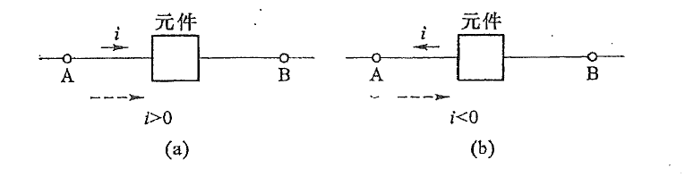
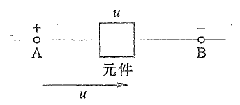
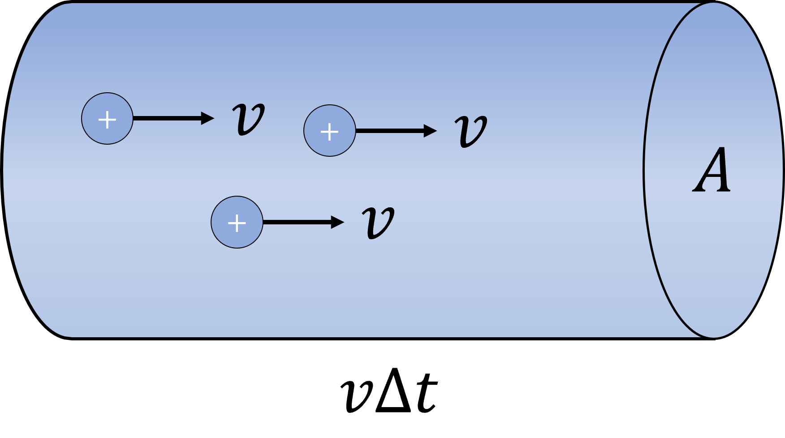
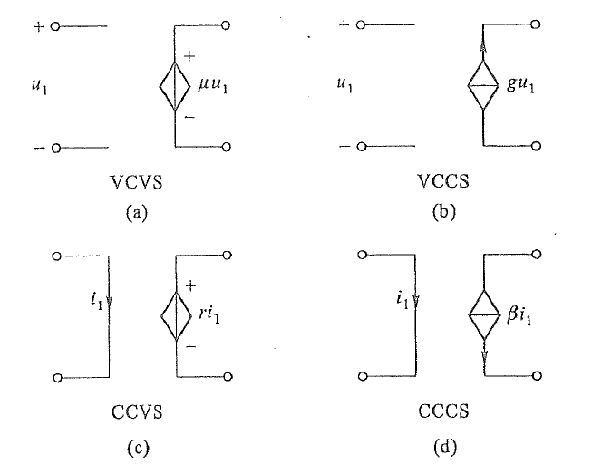

# 第一章：电路模型与电路定律

## 电路和电路模型

在实际生产生活中，我们需要用到各种电子设备，如果你好奇这些电子设备的运作原理并把它们拆开查看内部构造，你看到的基本都是一块上面布满各种电子元件的板子，这就是一种典型的**电路零件**，电路零件是由**电阻器、电容器、电感器**等一系列**电路部件**组成的。

> 激励：电路中负责发生电能或电信号的装置称为**激励源**或简称**激励**。
>
> 响应：由于激励而在电路中产生电压、电流等的电路元件称为**响应**。

显然：有激励不一定有响应，但有响应就意味着一定存在激励，因此有时为了显示出**激励和响应之间的因果关系**，我们也把激励称作输入，而把响应称作输出。

为了方便叙述，我们引入几个名词：

> 电路元件的端（端子）：电路元件的**输入和输出称为电路元件的端子**，按照输入和输出数量的不同，可以分为二端元件、三端元件甚至是多端元件。
>
> 电路模型：为实际电路抽象出来的方便利用理论研究相关性质的**数学模型**称为该实际电路的电路模型。**不同的实际电路往往对应着不同的电路模型，同一实际电路在不同工作条件下也可能对应着不同的电路模型。**
>
> 理想电路元件：**用于组成电路模型**的、**具有确定的电磁性质**的、**有着精确数学定义**的**最小**的电路结构。有时也简称**理想元件**。
>
> 电流源（电压源）：以电流（电压）作为激励，则这个电流（电压）称作电流源（电压源）。
>
> 负载：在电路中消耗电磁能量维持运转的电路部件的称作负载。

这里的”最小“并不指该结构的几何尺寸是电路中最小的，而是说这个结构**不能再拆成其他电路元件的组合**了。举个例子：电阻器就是一个理想电路元件，因为电阻器再拆分就涉及到导体的微观结构了，而电路理论并不研究导体的微观结构。因此电阻器作为一种电路元件一定是理想元件。除了电阻器之外，电容器和电感器也都是理想元件。注意一点：在电路理论中也把导线视作理想元件，并且**导线的电阻永远为零**。一旦导线电阻不为零，我们总可以把这种导线等价成两条理想导线与一个阻值相同的电阻器的串联结构，因此电阻不为零的导线并不是一个理想元件。

> 电路建模：利用理想元件组装并模拟实际电路的过程称作对这个实际电路进行建模。

## 电流和电压的参考方向

### 电流和电压

我们用$U_{12}$表示一个电荷量为$q$的**正电荷从电位为**​**$\varphi_1$**​**的位置移动到电位为**​**$\varphi_2$**​**的位置时电场力对正电荷所做的功**，即

$$
U_{12} = q(\varphi_1 - \varphi_2) = q\Delta \varphi
$$

把$U_{12}$称作该电荷在这**两点之间的电压**（有时也称为**电压降**）。现在考虑一个带有无穷小电荷量$dq$的正电荷，经过一个无穷小位移，电位产生了一个无穷小增量$d\varphi$，于是我们就可以定义无穷小电荷在这个过程中的电压：

$$
U = \dfrac{dw}{dq}
$$

其中$dw$称为该过程电场力所做的的微功（也称元功）。我们用符号$I$表示流过元件（或某一回路）的**电流**（正电荷的流动方向定义为电流的实际方向，并且由高电位指向低电位）。在实际计算电压和电流的时候，我们往往并不能提前知道电路中高电位和低电位的位置，自然就无法知道电流在回路中的实际流向，但是我们还要计算电压和电流。因此我们可以***假设一个电流方向***，通过结果的符号反过来判断电流的实际流向，得到了电流的实际流向自然也就能知道高、低电位的位置了。

这个假设出来的电流方向就是所谓的**参考方向**。参考方向是人为指定的。如果电流的实际方向和参考方向相同，那么计算得到的电流应当是正值；如果实际方向和参考方向相反，那么计算得到的电流应该是负值。

​​

和电流一样，电压也可以规定一个参考方向，只不过由于电流是从高电位流向低电位的，因此**电压的参考方向是从高电位指向低电位**的。如下图所示：

​​

同样，如果电压的参考方向和实际方向相同，那么计算出的电压也是一个正值；反过来那么计算得到的电压就是一个负值。用电位的语言说就是：电压为负值代表实际是低电位减去高电位，正值则说明是高电位减去低电位。我们要强调一点：电流和电压的所谓参考方向并不是实际的”方向“，而是一种用于标定电流和电压符号的规则，**参考方向可以任意指定。** 我们之所以强调如上的两条规则是因为这么规则参考方向可以使得计算过程更加简单。

### 关联参考方向和非关联参考方向

关联参考方向：如果**电流和电压的参考方向相一致**，则称这两个参考方向是关联的，叫做**关联参考方向**；反之，如果两个参考方向不一致，则称二者是非关联的，抑或称为**非关联参考方向**。

### 电功率的定义和电路中的能量

在中学物理的学习中，我们将电流定义为**单位时间内通过导体某个截面上的电荷量**。

​​

我们假设导体内流动的都是正电荷，正电荷的运动速度是$v$，经过$\Delta t$时间后连同这块面积为$A$的截面形成一个微小的圆柱。设正电荷在柱体内的电荷密度为$\rho$，那么在柱体内的电荷量就是

$$
\Delta Q = \rho\Delta V = \rho A v \Delta t
$$

于是电流$I=\dfrac{\Delta Q}{\Delta t} = \rho v A$。这个定义式在电动力学中的形式是电流密度$\bm{J}$点乘面元矢量$d\bm{S}$。但在电路中我们将电流定义为**电荷量对时间的导数**：

$$
i := \dfrac{dq}{dt}
$$

我们在中学学习电磁学时，定义了电动率$P=\dfrac{W}{t}$，但是对于一般的电路而言，这种电功率只是电路元件在**一段时间内的平均动率**。面对更复杂的电或者研究电路的瞬态性质时，我们必然回涉及到研究**瞬态过程中的电功率**（电功率是描述电路处于某个瞬态的物理量）。我们可以用**电功对时间的导数**：

$$
p = \dfrac{dW}{dt}
$$

定义瞬态过程的电功率，按照求导的链式法则可以得到

$$
p = \dfrac{dw}{dq}\dfrac{dq}{dt} = ui
$$

从电功率的定义中我们不难发现：

$$
W(t) = \int_{q(t_0)}^{q(t)}pdq = \int_{t_0}^{t} u(\xi)i(\xi)d\xi
$$

电路元件在电路中有两种功率：**吸收功率**和**发出功率**。

> 吸收功率（发出功率）：当$p>0,W>0$，这时的功率称作元件的吸收功率，代表元件吸收了这些电磁能量；相反，如果$p<0,W<0$，说明元件吸收了负的这些电磁能量，也就是发出了这些电磁能量。

在这里引用石群老师的一个简单易行的记忆方法：

1. 功率的符号决定了它是吸收功率还是发出功率：正号代表吸收功率，负号代表发出功率。
2. 看电流和电压参考方向是不是关联参考方向：如果参考方向关联，那么电流（或电压）带上一个正号，否则电流（或电压）就带上一个负号。
3. 假设最初计算的是吸收功率，那么就根据计算结果的符号判断功率的类型：结果为正则是吸收功率；结果为负则是发出功率。发出功率同理。

### 集总参数电路、线性与非线性元件

电路元件通过端子与电路的其他部分相互连接形成一个电路。元件的电磁特性可以通过端子上的电路物理量（电流、电压、电容和电感等物理量）构成的函数表达式$F(u,i,C,L,\cdots)=0$表达出来。

> 线性元件（非线性元件）：可以用线性关系表达电磁特性的元件称作**线性元件**；反之只能用非线性关系表达电磁特性的元件就称作**非线性元件**。

> 集总参数元件：对于一个二端元件，**流入该元件的电流一定等于流出该元件的电流，并且两端之间的电压为常数**，则称这个元件 是一个集总参数元件。
>
> 集总参数电路：仅由有限个集总参数元件组成的电路称为集总参数电路。

集总参数元件的定义告诉我们这样一件事：电磁过程只发生在元件内部，不表现在端子上。

这里强调一点：不是所有的电路都可以视作集总（参数）电路，有一些电路是不能看作集总参数电路的，在第十八章中我们会详细讨论一个电路可以被看作集总电路的充分必要条件。

#### 电阻元件

> 电阻元件：能削弱流经其的电流的元件称作电阻（元件）。
>
> 线性时不变电阻：伏安特性曲线呈现线性函数关系（满足Ohm定律）的电阻元件称作线性时不变电阻。

电阻元件会削弱流过它的电流，当端电压$u$加大之后，对应的电流$i$会产生一些线性或非线性的变化，这种变换总可以写成一个函数关系式：

$$
f(u,i)=0
$$

这称为电阻元件的伏安特性，对应的在$u-i$平面上的曲线则称为该电阻元件的**伏安特性曲线**，曲线上每一点的斜率$k=u'(i)$就是电阻器在这种工作条件下的阻值。如果函数$f$是线性的，那么我们就称这是一个**线性电阻**。进一步地，如果这个函数关系不含时（与时间变量无关），则我们称这是一个**线性时不变电阻**。我们在中学所学的电阻元件都是线性时不变电阻。

> Ohm定律（仅适用于**线性时不变电阻**）：对于一个线性时不变电阻，设电阻两端电压为$u$，流过该电阻的电流为$i$，并且$u,i$的参考方向相关联，则Ohm定律指出：
>
> $$
> u = Ri \\
> i = Gu \\
> $$
>
> 其中$R$是电阻器的**电阻**，单位为Ohm（欧姆），$G = \dfrac{1}{R}$是电阻器的**电导**，单位为Siemens（西门子）。

电阻和电导这两个物理量的含义是十分鲜明的：**电阻越大电导越小，电阻越小电导越大。**

如果如果$u,i$的参考方向非关联，那么Ohm定律要改为$u=-Ri,i=-Gu$。

我们来计算一下线性时不变电阻的电功率：

$$
p = ui = Ri^2 = \dfrac{u^2}{R}
$$

​​

如果是参考方向是非关联的，那么电功率就是$p = -ui = -Ri^2 = -\dfrac{u^2}{R}$。​

我们给出电路的开路和短路的定义：

> 开路：在电路的开路位置电流为零并且电压任意大（开路可以等价看作是阻值无穷大或电导为零的电阻器）。
>
> 短路：电路的短路位置电压为零并且电流任意大（短路可以看作是阻值为零或电导无穷大的电阻器）。

#### 电压源与电流源

> 理想电压源：理想电压源是一个**二端有源元件**，它的**端电压恒等于一个给定的函数**​**$u_S(t)$**​ **，并且不受流过源的电流**​**$i$**​**的影响。** 这样的电源称为理想电压源。
>
> 理想电流源：理想电流源是一个**二端有源元件**，由它输出的电流**恒等于一个给定的函数**​**$i_S(t)$**​ **，并且不受端电压**​**$u$**​**的影响。** 这样的电源称为理想电流源。

> 定理1：理想电压源不能被短路。
>
> 证明：若理想电压源可以被短路，则根据定义可知，端电压必须相等，这意味着端电压将受到回路电流的影响，与定义相悖，故理想电压源不能被短路。

> 推论1：理想电压源的吸收功率$p_S = iu_S$，其中$i$是通过理想电压源的电流，$u_S$是理想电压源的端电压。

> 定理2：理想电流源不能被开路。
>
> 证明：若理想电流源所在的回路不闭合，那么就不存在电流，即不存在输出电流，这与定义相悖，故理想电流所在回路源必须闭合。

> 推论2：理想电流源的吸收功率$p_S = ui_S$，其中$u$是理想电流源的端电压，$i_S$是理想电流源的输出电流。

#### 受控电源（非独立电源）

我们在前面介绍的都是独立电源，即**电压（或电流）仅与时间**​**$t$**​**有关，而与其他电路变量无关。** 有一类电源不仅与时间变量有关，同时还受到电路中其他电学量的控制。这种不独立的电源就叫做所谓的**受控电源**。

按照控制和被控制的类型，受控电源可以分为：受电流控制的电压源（CCVS），受电压控制的电压源（VCVS），受电流控制的电流源（CCCS），受电压控制的电流源（VCCS）。

一般来说，大多数受控电源是一个**四端元件**（控制端和受控端都是二端元件）。下图中的四个受控源都属于**线性受控源**，$\mu,\beta$都是**无量纲量**，其中$g$称为**转移电导**，$r$称作**转移电阻**。

​​

### 【第一章重点】基尔霍夫定律（KCL，KVL）

基尔霍夫定律是分析集总参数电路的强大工具。基尔霍夫定律一共包含两条定律：基尔霍夫电流定律（KCL）和基尔霍夫电压定律（KVL）。再给出基尔霍夫定律的完整表述之前，我们先给出一些概念。

> 1. 支路（第一定义）：电路中的每一个二端元件都是一个支路。
> 2. 支路（第二定义）：电路中流过同一股电流的路径就是一个支路。
> 3. 节点（第一定义）：元件与元件之间的连接点称作电路的节点。
> 4. 节点（第二定义）：三条及以上的支路的交点。
> 5. 路径：两个节点之间的一条通路。
> 6. 回路（一般不考虑方向）：电路中闭合的路径称作回路。
> 7. 网孔：若回路内部不存在任何其他更小的回路，则这样的回路就叫做网孔。

> 推论3：网孔一定是回路，但回路不一定是网孔。

我们给出两条基尔霍夫定律：

> 1. 基尔霍夫电流定律：流经同一节点的电流的代数和为零。（按参考方向，同向为正反向为负）
> 2. 基尔霍夫电压定律：同一回路上的全部电压降的代数和为零。（按参考方向，同向为正反向为负）

**只要是集总电路，基尔霍夫定律总是成立的。**

‍
